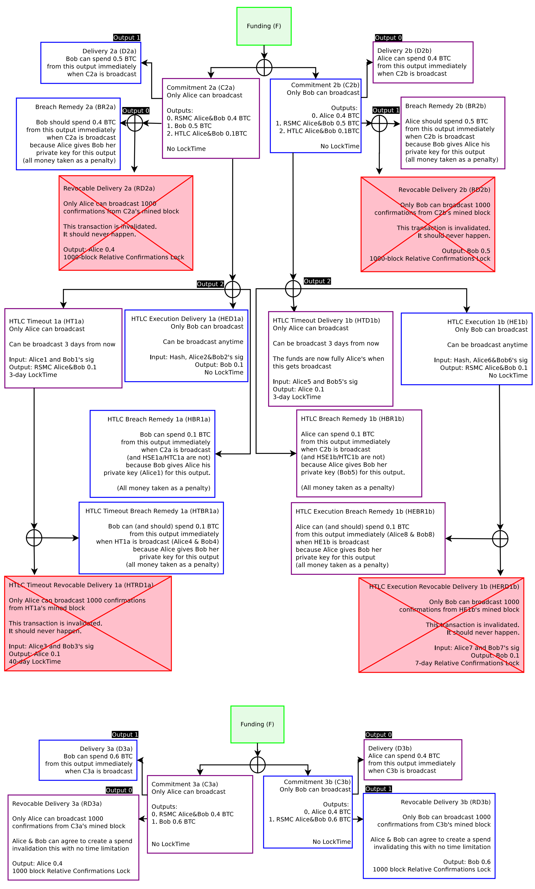

# Lightning Network Transaction Flow

The basic concept of lightning network is simple. For further understanding, express lightning network transaction flows as javascript code referring to white paper.

## Get started

### Run install command
`npm install`

### Execute flow
`node flow.js` 
If I puck pack all transactions flows into flow.js, it will hard to read. So I divide into several branches. Please checkout.

## Spend Revocable Delivery
Please checkout 'spend-RD' branch and refer to following blog post for further information. 

Blog Post: [Simplified code of Bitcoin Lightning Network — Spend Revocable Delivery](https://medium.com/@t.tak/simplified-code-of-bitcoin-lightning-network-spend-revocable-delivery-90e50f0256d5)

## Spend Breach Remedy
Please checkout 'spend-BR' branch and refer to following blog post for further information. 

Blog Post: [Simplified code of Bitcoin Lightning Network part2 — Spend Breach Remedy](https://medium.com/@t.tak/simplified-code-of-bitcoin-lightning-network-part2-spend-breach-remedy-997de8a21f29)

## Spend HTLC Execution Revocable Delivery
Please checkout 'spend-HERD' branch and refer to following blog post for further information. 

Blog Post: [Simplified code of Bitcoin Lightning Network part3 — Spend HTLC Execution Revocable Delivery](https://medium.com/@t.tak/simplified-code-of-bitcoin-lightning-network-part3-spend-htlc-execution-revocable-delivery-49991e3cfe34)

## Spend HTLC Breach Remedy
Please checkout "spend-HBR" branch and refer to following blog post for further information. 

Blog Post: [Simplified code of Bitcoin Lightning Network part4 — Spend HTLC Breach Remedy](https://medium.com/@t.tak/simplified-code-of-bitcoin-lightning-network-part4-spend-htlc-breach-remedy-61ebc5587fc4)
 

